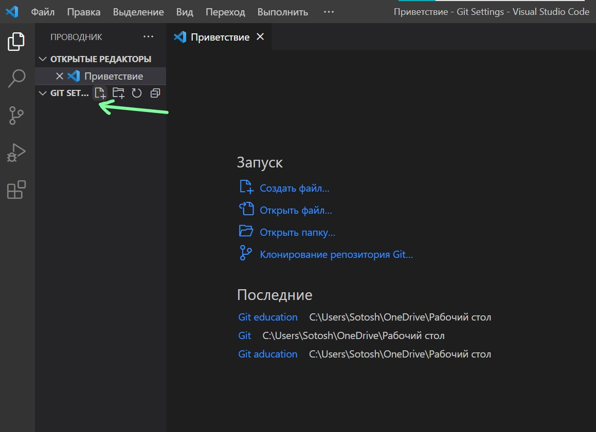
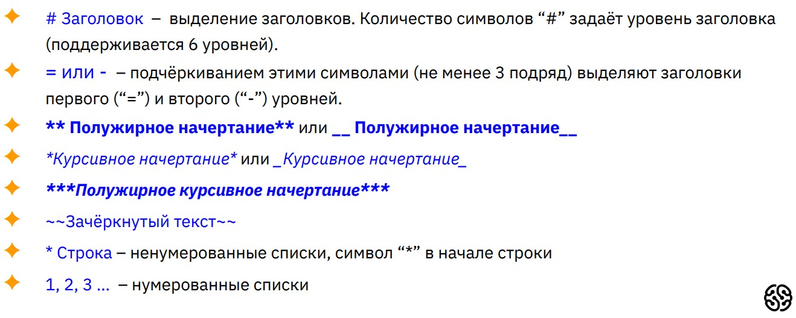
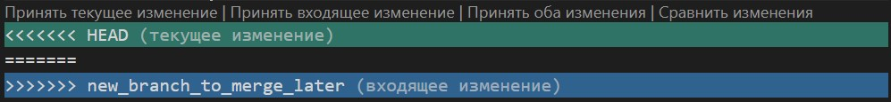
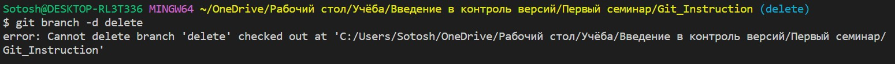
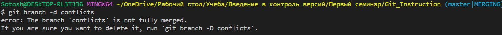

# Работа с Git

## 1. Проверка наличия установленного Git

В терминале выполнить команду `git --version`.
Если Git установлен, появится сообщение с информацией о версии программы. Иначе будет сообщение об ошибке.

## 2. Установка Git

Загружаем последнюю версию Git с сайта https://git-scm.com/downloads.
Устанавливаем с настройками по умолчанию.

## 3. Настройка Git

При первом использовании Git необходимо представиться. Для этого нужно ввести в терминале 2 команды:
```
git config --global user.name <Ваше имя английскими буквами>
git config --global user.emal <адрес_почты@example.com>
```

## 4. Инициализация репозитория

*Репозиторий* — это место, в котором систематизируется проект.
Для создания нового репозитория необходимо:
* Сочетанием клавиш **CTRL + K CTRL + O** открыть/создать папку на компьютере, в которой будет храниться файл репозитория.
* В папке создать файл репозитория с расширением *.md* (при работе с языком Markdown):



* Выполнить инициализацию репозитория с помощью выполнения команды в терминале:
``` 
git init 
```
* Выполнить Initial Commit с помощью двух команд:
```
git add <ИмяФайла.md>
git commit -m "Initial commit"
```

## 5. Синтаксис языка Markdown

><sup>*Перед началом работы в репозитории желательно 
настроить автосохранение.
Для этого проходим по ветке Файл →  Автосохранение.*</sub>

Синтаксис языка Markdown можно найти по ссылке в справочнике от __Microsoft__ https://learn.microsoft.com/ru-ru/contribute/markdown-reference

Основные инструменты для работы с разметкой Markdown:



## 6. Основные команды Git

### 6.1 Запись изменений в репозиторий

* Для добавления файла или файлов к следующему коммиту используется команда:
```
git add <ИмяФайла.расширение>
```
><sup>*Для того, чтобы не писать все имя файла, можно начать вводить его название, а затем нажать клавишу __TAB__*</sub>

* Для создания коммита (сохранения) используется команда:
```
git commit -m "Сообщение, которое Вы хотите оставить"
```
* Для того, чтобы увидеть разницу между текущим файлом и закоммиченным файлом, используется команда:
```
git diff
```
* Для того, чтобы получить информацию от git о его текущем состоянии, необходима команда:
```
git status
```

### 6.2 Просмотр истории коммитов

* Для того, чтобы вывести на экран историю всех коммитов с их хеш-кодами, применяется команда:
```
git log
```

### 6.3 Перемещение между сохранениями

* Для перехода от одного коммита к другому используется команда:
```
git checkout <хеш-код коммита>
```
><sup>*Для того, чтобы не писать весь хеш-код коммита, достаточно ввести первые три-четыре символа*</sub>

* Для того, чтобы вернуться к актуальному состоянию и продолжить работу, необходима команда:
```
git checkout master 
```

## 8. Игнорирование файлов

Для того, чтобы исключить из отслеживания в репозитории определенные файлы или папки, необходимо создать там файл ***.gitignore*** и записать в него их названия или шаблоны, соответствующие таким файлам или папкам. Например, *.jpg или *.png

## 9. Создание веток в Git

Ветка в Git — это простой перемещаемый указатель на один из коммитов, обычно последний в цепочке коммитов.
По умолчанию имя основной ветки в Git — **master**.
Создать ветку можно командой:
```
git branch <название новой ветки>
```
В результате создается новый указатель на текущий коммит.

## 10. Слияние веток в Git

Для слияния одной ветки с другой необходимо перейти на ту ветку, в которую нужно добавить информацию из другой ветки, путем применения команды:
```
git checkout <Имя ветки>
```
После этого выполнить в терминале команду:
```
git merge <Имя ветки>
```
Если слияние прошло успешно, выполнить коммит слияния.

## 11. Разрешение конфликтов слияния в Git

При слиянии веток может возникнуть конфликт, если на одних и тех же строках была записана разная информация. Тогда пользователю предлагаются несколько способов разрешения конфликта слияния:
* Принять текущее изменение
* Принять входящее изменение
* Принять оба изменения
* Сравнить изменения

Выглядеть это будет примерно так:



Эти новые строки можно рассматривать как «разделители конфликта». Строка ======= является «центром» конфликта. Все содержимое между этим центром и строкой <<<<<<< HEAD находится в текущей ветке main, на которую ссылается указатель HEAD. А все содержимое между центром и строкой >>>>>>> new_branch_to_merge_later является содержимым ветки для слияния.

## 12. Удаление веток в Git

Для удаления веток необходимо использовать команду:
```
git branch -d <имя ветки>
```
При попытке удалить ветку, на которой в данный момент назодится пользователь, будет получено сообщение об ошибке:



При попытке удалить ветку, с которой не перенесли всю информацию, будет получено сообщение об ошибке и дальнейшая рекомендация:



Если пользователь уверен, что хочет удалить ветку, необходимо использовать команду:
```
git branch -D <имя ветки>
```
